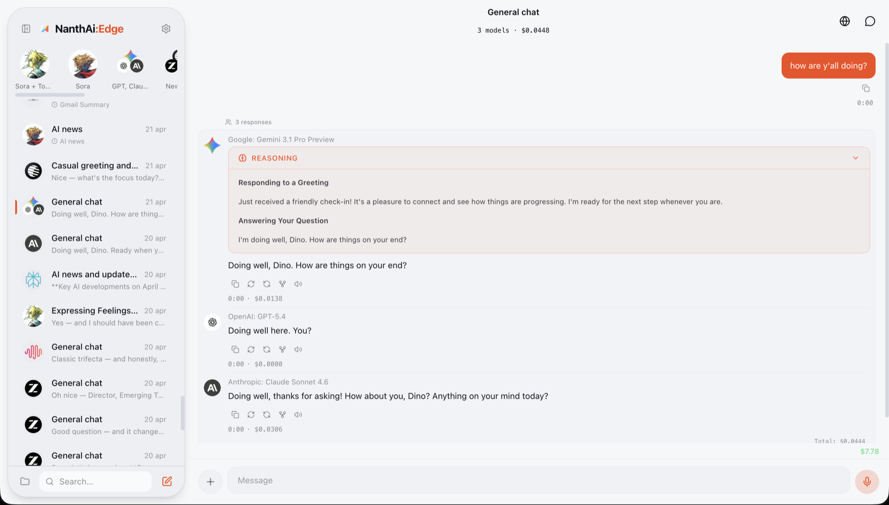
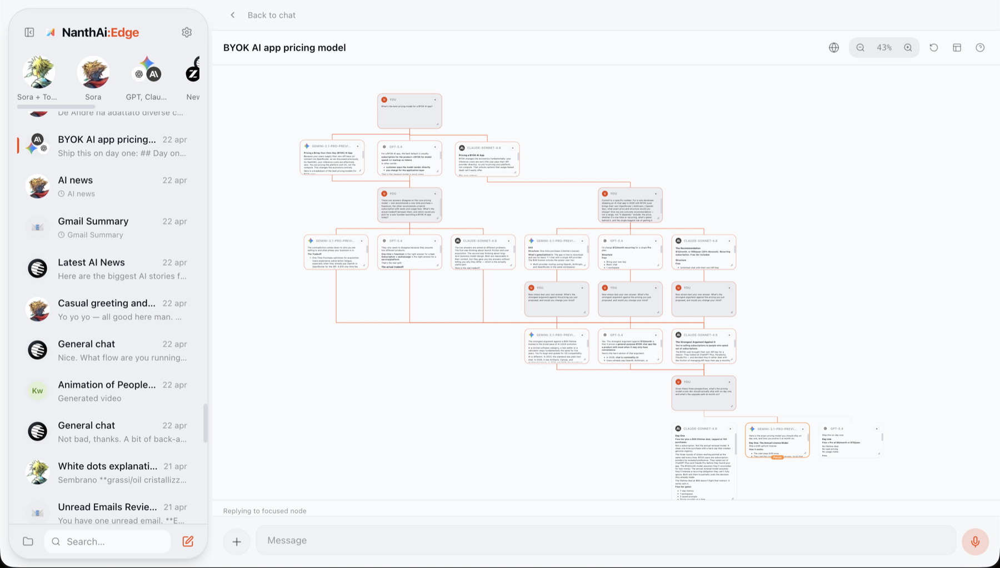
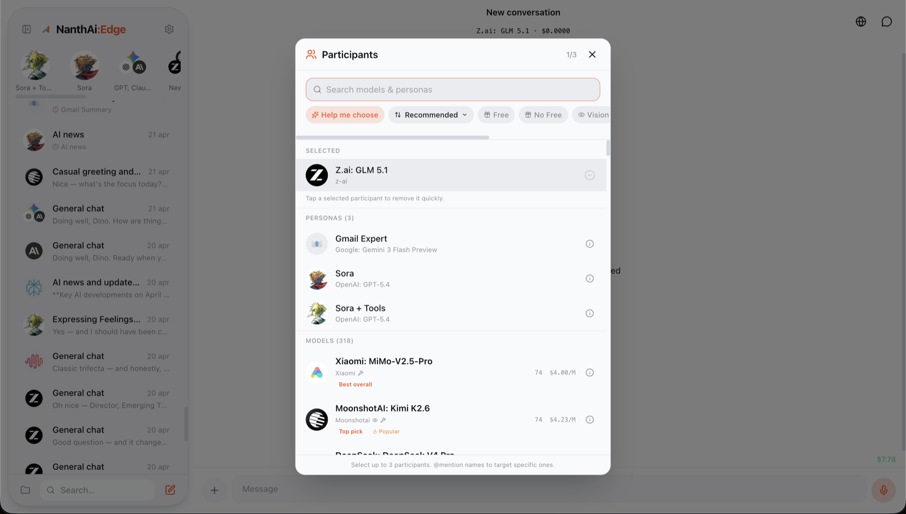

# NanthAI Edge

> **A self-hostable AI workspace for people who want control.** Run a polished multi-model chat app with personas, memory, tools, scheduled jobs, document workflows, and your own OpenRouter key.

[](/LICENSE)

---

## What is NanthAI Edge?

NanthAI Edge is a production-grade AI chat platform you can study, run, and adapt. It combines a React/Vite web app with a real-time [Convex](https://convex.dev) backend, [Clerk](https://clerk.com) auth, and per-user OpenRouter OAuth so every user brings their own AI account.

This repository contains the **web client** and **Convex backend**. It is meant for builders who want more than a starter chat demo: model comparison, persistent product state, memory, tools, integrations, and real backend contracts are all here.

## Screenshots



| Ideascape branching canvas | Model and persona picker |
|----------------------------|--------------------------|
|  |  |

## Why Use It?

- **Bring your own AI account** — no shared server-side OpenRouter key, no hidden inference bill for the host.
- **Compare models in one conversation** — send the same turn to multiple models and keep the outputs side-by-side.
- **Build on a real app architecture** — Convex schema, actions, streaming, crons, tests, web routes, and public docs are included.
- **Host the parts you care about** — core chat works with only Convex, Clerk, and OpenRouter; integrations are optional.
- **Learn from a complete implementation** — tool execution, retry contracts, generated files, memory, OAuth, search, and scheduled jobs are implemented as product surfaces, not isolated examples.

## What You Get

- **Multi-model chat** — Send to 2–3 models simultaneously, compare side-by-side
- **Personas** — Custom AI alter-egos with model assignment, system prompts, parameter overrides
- **AI Skills** — Progressive disclosure skill system with catalog and per-chat bindings
- **Internet Search** — 3 tiers (Basic, Web Search, Research Paper) with complexity settings
- **Memory** — Vector-based memory with 10 categories, extraction modes, persona scoping
- **Document Workflows** — Generate, read, edit, cite, and attach DOCX/PPTX/XLSX/text-style artifacts
- **Audio Messages** — Voice recording, TTS playback, auto-audio mode
- **Scheduled Jobs** — Recurring AI tasks with multi-step pipelines
- **Integrations** — Google Workspace, Microsoft 365, Notion, Slack, Cloze, and calendar/email tools
- **BYOK** — Every user brings their own OpenRouter API key via PKCE OAuth. No server-side AI key needed.

## What This Repo Is Best For

| Use case | Why it fits |
|----------|-------------|
| Self-hosted AI workspace | You can run the web app and Convex backend with your own auth and user-provided AI keys |
| AI product reference app | The codebase shows real patterns for streaming, tools, memory, OAuth, files, search, and scheduled work |
| Team or client prototype | Start from a complete app instead of wiring auth, storage, streaming, and model selection from scratch |
| Learning Convex + AI apps | The backend is organized around queries, mutations, actions, crons, schema files, and contract tests |

## Self-Hosting Quick Start

### Prerequisites

- [Node.js](https://nodejs.org/) 20+
- A free [Convex](https://convex.dev) account
- A free [Clerk](https://clerk.com) account
- An [OpenRouter](https://openrouter.ai) account (each user provisions their own key)

### 1. Clone and install

```bash
git clone https://github.com/thevarsek/nanthai-edge-oss.git
cd nanthai-edge-oss
npm install
cd web && npm install && cd ..
```

### 2. Set up Convex

```bash
npx convex dev
```

This creates a new Convex project, generates the `convex/_generated/` type stubs, and starts the development server. The `_generated/` directory is not included in this repo — it is created automatically on first run. Note your deployment URL.

### 3. Set up Clerk

1. Create a Clerk application at [clerk.com](https://clerk.com)
2. Note your **Publishable Key** and **JWT Issuer Domain**
3. Configure Clerk as a Convex auth provider — see [Convex + Clerk docs](https://docs.convex.dev/auth/clerk)

### 4. Configure environment variables

Copy the example files and fill in your values:

```bash
# Root — Convex CLI config
cp .env.example .env.local

# Web — Vite frontend config
cp web/.env.example web/.env.local
```

Then set the required Convex backend env vars:

```bash
npx convex env set CLERK_JWT_ISSUER_DOMAIN https://your-instance.clerk.accounts.dev
```

See `.env.example` for the full list of optional env vars (Stripe, Google, Microsoft, Notion, Slack, Vercel Sandbox, push).

### 5. Run the dev server

```bash
# Terminal 1 — Convex backend
npx convex dev

# Terminal 2 — Web frontend
cd web && npm run dev
```

Open `http://localhost:5173`, sign in with Clerk, connect OpenRouter, and start chatting.

## Optional Capabilities

NanthAI Edge starts small and expands as you configure more providers:

| Capability | Required setup |
|------------|----------------|
| Core chat, personas, memory, model picker | Convex, Clerk, OpenRouter user connection |
| Google Drive/Calendar | Google OAuth client and Picker credentials |
| Microsoft 365 | Microsoft OAuth app |
| Notion | Notion OAuth app |
| Slack tools | Slack OAuth app |
| Payments / Pro gates | Stripe env vars |
| Heavy runtime tools | Vercel Sandbox env vars |
| Web push | VAPID keys |

## Project Layout

```
nanthai-edge-oss/
├── convex/                    # Convex backend (TypeScript)
│   ├── schema.ts              # Database schema
│   ├── chat/                  # Chat orchestration, streaming, audio
│   ├── tools/                 # AI tools (apple, google, microsoft, notion, workspace)
│   ├── memory/                # Vector memory system
│   ├── models/                # Model catalog sync
│   ├── push/                  # Web push delivery
│   ├── tests/                 # Backend test suite
│   └── ...                    # Personas, folders, preferences, skills, etc.
├── web/                       # Web client (React + Vite + TypeScript)
│   ├── src/                   # App source
│   └── public/                # Static assets, SEO files
├── docs/                      # Architecture documentation
├── .env.example               # Backend env var reference
├── web/.env.example           # Frontend env var reference
├── LICENSE                    # Source-available license
├── COMMERCIAL_LICENSE.md      # Commercial licensing info
└── CONTRIBUTING.md            # Contribution guidelines
```

## Architecture

```
┌──────────────────────────────────────────────┐
│          Web Client (React + Vite)           │
│     React Router · Tailwind · shadcn/ui      │
├──────────────────────────────────────────────┤
│              Clerk Identity Auth              │
│          (@clerk/clerk-react)                │
├──────────────────────────────────────────────┤
│            Convex React Client               │
│   (WebSocket subscriptions, mutations, actions)│
├──────────────────────────────────────────────┤
│            Convex Backend (Server)            │
│  Schema · Mutations · Actions · Queries · Crons│
│  StreamWriter · OpenRouter · Memory · Tools   │
├──────────────────────────────────────────────┤
│         OpenRouter (300+ AI models)           │
│       API key via PKCE, per-user              │
└──────────────────────────────────────────────┘
```

- **Auth:** Clerk manages identity. OpenRouter API key provisioned per-user via PKCE OAuth.
- **Data:** All persistence is Convex server-side. The web client subscribes to reactive queries over WebSocket.
- **Streaming:** Server-side OpenRouter calls via Convex Actions. `StreamWriter` patches message content in-place.
- **Tools:** 76 built-in AI tools execute server-side in Convex actions.
- **BYOK:** There is no server-side OpenRouter API key. Every user connects their own OpenRouter account.

## Environment Variables Reference

### Root `.env.local` (Convex CLI)

| Variable | Required | Purpose |
|----------|:--------:|---------|
| `CONVEX_DEPLOYMENT` | Yes | Convex deployment name |
| `CONVEX_URL` | Yes | Convex deployment URL |
| `CONVEX_SITE_URL` | Yes | Convex HTTP endpoint URL |
| `CLERK_JWT_ISSUER_DOMAIN` | Yes | Clerk JWT issuer |

### `web/.env.local` (Vite frontend)

| Variable | Required | Purpose |
|----------|:--------:|---------|
| `VITE_CONVEX_URL` | Yes | Convex deployment URL |
| `VITE_CLERK_PUBLISHABLE_KEY` | Yes | Clerk publishable key |
| `VITE_WEB_PUSH_VAPID_PUBLIC_KEY` | No | Web push notifications |
| `VITE_GOOGLE_CLIENT_ID` | No | Google integration |
| `VITE_MICROSOFT_CLIENT_ID` | No | Microsoft integration |
| `VITE_NOTION_CLIENT_ID` | No | Notion integration |

### Convex Backend Env Vars (set via `npx convex env set`)

| Variable | Required | Purpose |
|----------|:--------:|---------|
| `CLERK_JWT_ISSUER_DOMAIN` | Yes | Auth token validation |
| `ARTIFICIAL_ANALYSIS_API_KEY` | No | Model benchmark enrichment |
| `STRIPE_SECRET_KEY` | No* | Payment processing |
| `STRIPE_PRICE_ID` | No* | Pro tier product |
| `STRIPE_WEBHOOK_SECRET` | No* | Stripe webhook verification |
| `WEB_APP_URL` | No* | Web app URL (for Stripe redirects) |
| `CONVEX_SECRET_ENCRYPTION_KEY` | No | Encrypt stored app passwords/API keys |
| `GOOGLE_CLIENT_ID` | No | Google OAuth |
| `GOOGLE_WEB_CLIENT_ID` | No | Google web OAuth |
| `GOOGLE_WEB_CLIENT_SECRET` | No | Google OAuth secret |
| `MICROSOFT_CLIENT_ID` | No | Microsoft OAuth |
| `MICROSOFT_CLIENT_SECRET` | No | Microsoft OAuth secret |
| `NOTION_CLIENT_ID` | No | Notion OAuth |
| `NOTION_CLIENT_SECRET` | No | Notion OAuth secret |
| `SLACK_CLIENT_ID` | No | Slack OAuth |
| `SLACK_CLIENT_SECRET` | No | Slack OAuth secret |
| `VERCEL_SANDBOX_TOKEN` | No | Vercel Sandbox runtime |
| `VERCEL_SANDBOX_PROJECT_ID` | No | Vercel Sandbox runtime |
| `VERCEL_SANDBOX_TEAM_ID` | No | Vercel Sandbox runtime |
| `WEB_PUSH_VAPID_PUBLIC_KEY` | No | Web push notifications |
| `WEB_PUSH_VAPID_PRIVATE_KEY` | No | Web push notifications |
| `WEB_PUSH_VAPID_SUBJECT` | No | Web push sender identity |
| `FCM_PROJECT_ID` | No | FCM push delivery |
| `FCM_CLIENT_EMAIL` | No | FCM push delivery |
| `FCM_PRIVATE_KEY` | No | FCM push delivery |

\* All four Stripe/WEB_APP_URL vars are required together if you enable Pro tier payments. Without them the app works fine — Pro gating is simply disabled.

## Running Tests

```bash
# Convex backend tests
npx tsx --test convex/tests/*.test.ts

# TypeScript type checking (backend)
npx tsc --noEmit --project convex/tsconfig.json

# TypeScript type checking (web)
cd web && npx tsc --noEmit --project tsconfig.app.json

# Lint checks
npm run lint

# Individual lint checks
npm run convex:lint
cd web && npm run lint
```

## Contributing

Useful contributions are welcome: docs fixes, setup improvements, tests, Convex backend hardening, web UI polish, and provider integration fixes. See [CONTRIBUTING.md](CONTRIBUTING.md) for guidelines.

Contributions use an inbound=outbound model — by submitting a PR you grant the author rights to include your work in commercial versions.

## License

NanthAI Edge is **source-available** software.

- **Personal use, self-hosting, evaluation, learning** — free, no license needed.
- **Commercial use** — requires a paid [Commercial License](COMMERCIAL_LICENSE.md).

See [LICENSE](LICENSE) for full terms or visit [nanthai.tech/licensing](https://nanthai.tech/licensing).

**Contact:** [support@nanthai.tech](mailto:support@nanthai.tech)
