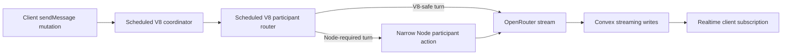

# Chat TTFT investigation — 2026-07-28

## Executive conclusion

The latency is real and primarily shared backend latency, not an iOS-only
rendering problem.

- All three clients call `chat/mutations:sendMessage` and subscribe to
  `chat/queries:listStreamingMessages`.
- The M47 path added two durable Workflow dispatch boundaries before the first
  provider request.
- M48 then accidentally placed `convex/chat/actions_runtime.ts` in Node, so the
  bounded coordinator and the normally V8-safe participant router both paid the
  Node runtime boundary.
- In the inspected production iOS trace, the provider emitted its first SSE
  event 6.1 seconds after the client send and the first streaming write reached
  the client subscription at roughly 7.9 seconds. OpenRouter accounted for only
  465 ms up to its first SSE event.
- PostHog confirms this is not a single-trace anomaly. The current iOS
  first-visible-content sample has a median of 9.7 seconds, p90 of 14.1 seconds,
  and p95 of 14.8 seconds. Client-side TTFT is not yet emitted by Android or web,
  so cross-platform client percentiles cannot currently be compared.

The right first move is to keep Convex and restore the intended V8/Node split.
An external Node service is not justified yet: the default Convex runtime has
no cold starts, and most of the avoidable delay is caused by how NanthAI enters
Workflow/Workpool, not by Convex realtime delivery.

## What changed

### Before M47

The old path still had scheduled action hops, so it was not free of latency.
However, a plain text turn stayed in the default Convex runtime and only crossed
to Node for capabilities that actually required Node.

### M47/M48 production path before this fix

```mermaid
flowchart LR
    A["Client sendMessage mutation"] --> B["Execution admission"]
    B --> C["Dispatch Workflow startAsync"]
    C --> D["Node coordinator action"]
    D --> E["Participant Workflow startAsync"]
    E --> F["Node participant router"]
    F -->|Node-required again| H["Node participant action"]
    F -->|Otherwise| G["OpenRouter stream"]
    H --> G
    G --> I["Convex streaming writes"]
    I --> J["Realtime client subscription"]
```

M47 was introduced by commit `c708cd0f` on 2026-07-19. M48 commit `63e7bd65`
on 2026-07-27 added `"use node"` to `actions_runtime.ts`. Git history gives no
Node-only requirement for that registration module. The module calls
web-standard APIs and already contains an explicit runtime router.

### Corrected runtime boundary

The corrected path keeps:

- the bounded coordinator in V8;
- the participant preflight and runtime routing in V8;
- explicit delegation to `actions_node.ts` for media, document, integration,
  expanded-profile, or restored-continuation work that requires Node.

Convex documents that its default runtime has no cold starts and that default
actions are faster than Node actions because they avoid Node startup:
[Convex runtimes](https://docs.convex.dev/functions/runtimes) and
[Convex actions](https://docs.convex.dev/functions/actions).

## Measured production latency

### PostHog, last seven days

The backend sample contains 103 response starts and 93 completed responses.
The client first-token sample contains only 13 events, all from iOS, so its
percentiles are directionally useful but not yet a cross-platform SLO dataset.

| Measurement | Median | p90 | Notes |
|---|---:|---:|---|
| Client send to first visible content | 9,665 ms | 14,090 ms | 13 iOS samples |
| Provider request to first content | 2,199 ms | 6,786 ms | Backend completion telemetry |
| Participant Workflow dispatch hop | 1,596 ms | 1,950 ms | `scheduler_hop_2_ms` |
| Participant preflight | 69 ms | 110 ms | Capability/routing preflight |
| Context assembly | 21 ms | 79 ms | Not a material bottleneck |
| Full OpenRouter round trip | 4,820 ms | 10,509 ms | Time to completion, not TTFT |

The first dispatch hop is logged as `schedulerHop1Ms` but is not persisted in
the terminal PostHog event, so an aggregate percentile is missing. The inspected
production trace measured it at 2,063 ms.

The gap between client TTFT and provider TTFT is not perfectly subtractable
because the populations differ, but the stage measurements and trace agree:
Workflow/runtime scheduling accounts for several seconds before the provider
can begin.

### One production trace

| Stage | Elapsed from client send |
|---|---:|
| Send mutation completed | ~317 ms |
| Coordinator code began | ~2,211 ms |
| Participant action code began | ~4,701 ms |
| OpenRouter request began | ~5,642 ms |
| First OpenRouter SSE event | ~6,107 ms |
| First streaming write began | ~7,804 ms |
| Realtime subscription recomputed | ~7,873 ms |

The mutation-to-subscription portion after a streaming write was about 25 ms.
That is strong evidence that Convex realtime transport and iOS subscription
delivery are not the multi-second bottleneck.

The 1.7-second gap from first SSE event to first write needs more precise
instrumentation. The first SSE event can contain only a generation identifier
or metadata, so it is not necessarily a visible token.

## Direct OpenRouter probe

The supplied disposable test key was used only in process memory and was not
written to the repository. Two short streamed probes were run per candidate.
These are directional cold-path observations, not statistically reliable model
rankings.

| Model / routing | First semantic delta observations |
|---|---:|
| Gemini 3.1 Flash Lite Preview, latency sort | 575–655 ms |
| Gemini 3 Flash Preview, latency sort | 974–1,031 ms |
| Claude Sonnet 4.6, latency sort | 865–1,414 ms |
| GPT-5.6 Sol, latency sort | 858–3,357 ms |
| GPT-5.6 Terra, latency sort | 1,988–2,023 ms |
| GPT-5.6 Terra, OpenRouter default | 1,233–3,363 ms |
| GPT-5.6 Terra, throughput sort | 656–2,202 ms |
| GPT-4.1 Mini, latency sort | 8,173–8,322 ms |
| GPT-5 Mini, latency sort | one 2,565 ms content sample; one reasoning-only limit |

The useful conclusion is not that one model has definitively won. It is that
direct provider TTFT is commonly below the application's end-to-end TTFT by
several seconds, and routing variance is large enough to require a real A/B
sample.

## OpenRouter routing

NanthAI currently sends `provider.sort = "latency"` for non-Anthropic requests.
This means lowest latency first, not descending latency. OpenRouter states that
an explicit sort disables its default price-weighted load balancing and tries
providers in sorted order. Anthropic requests with top-level cache control skip
the global sort because the eligible endpoint set and sticky cache routing are
already constrained.

Current OpenRouter behavior is documented here:

- [Provider routing](https://openrouter.ai/docs/guides/routing/provider-selection)
- [Latency and performance](https://openrouter.ai/docs/guides/best-practices/latency-and-performance)

`preferred_max_latency` is now a preference: endpoints outside the rolling
threshold are moved later rather than excluded. The stale source comment saying
that this field could reduce the endpoint set to zero has been corrected.

Do not select a routing policy from two-request probes. Run at least 100
production-equivalent requests per policy and compare:

- first reasoning token;
- first content token;
- total duration;
- failure and fallback rate;
- actual provider;
- input/output cost;
- ZDR, tools, cache-control, and web-search mode.

Also keep OpenRouter test and product accounts above the low-balance range.
OpenRouter documents more aggressive balance checks and cache expiry when the
balance is in single digits.

## Handoff regression safety

Removing `"use node"` does not remove Node capability. It restores the router
that decides when to cross the boundary.

The focused regression set covers:

| Pattern | Expected boundary |
|---|---|
| Plain text, no Node-only capability | V8 participant |
| Image, video, or audio output | V8 preflight → Node participant |
| Office/document tools and expanded runtime profiles | V8 preflight → Node participant |
| Google/Drive and connected integration paths | V8 preflight → Node participant |
| Drive attachment discovered during resume | Restored preflight → Node |
| Deferred tool checkpoint | Workflow successor with preserved route |
| Action continuation and compaction | Workflow successor with preserved deadline/fence |
| Subagents available but not selected | Stay in V8 |
| `spawn_subagents` selected | V8 deferred result → owned durable handoff |
| Presentation branches | Owned durable handoff |
| Node worker timeout or failure | Terminal fenced cleanup |

Validation completed:

- 49 focused routing, continuation, compaction, Workflow chaining, presentation,
  subagent, and Node failure tests passed;
- the complete Convex suite passed: 2,572 tests, 0 failures;
- Convex typecheck and lint passed with no warnings;
- development deployment and `health:check` passed;
- the iOS simulator build succeeded.

This validation snapshot was completed on DEV before the separately authorized
production rollout.

## Implementation status

The first optimization canary is now implemented on the backend and web
without iOS or Android application changes:

- the bounded coordinator is scheduled directly as a V8 action;
- the one-step outer generation dispatch Workflow is removed;
- participant Workflows still own every provider round, tool wait, subagent
  handoff, continuation, fence, cancellation, and terminal callback;
- participant Workflow start defaults to inline (`startAsync: false`) with
  `CHAT_GENERATION_WORKFLOW_START_ASYNC=true` as the rollback switch;
- the V8 participant router still delegates Node-required models, media, tools,
  and profiles before provider dispatch;
- the always-visible `parallel-subagents` capability remains in V8 until the
  model actually selects `spawn_subagents`; advertising that deferred tool no
  longer forces every ordinary turn through a pre-provider V8-to-Node
  checkpoint;
- a three-attempt bounded watchdog recovers a lost coordinator action without
  polling indefinitely or cancelling an already-discovered participant
  Workflow;
- OpenRouter requests prefer its lowest-observed-latency provider routing;
- backend analytics now records both scheduler hops, coordinator dispatch,
  V8/Node runtime, first delta, first committed streaming patch, and
  enqueue-to-milestone durations; and
- web records send/retry-to-first-visible-token from the real-time
  subscription, correlated by `client_event_id`.

The implementation was validated on DEV. Deployment state is deliberately kept
out of this architecture report and should be verified from the deployed Git
revision and the Convex dashboard.

## Recommendations in priority order

### P0 — ship the V8 boundary fix

Status: implemented; DEV redeployment and post-change canary measurement are
part of this change's verification.

Expected effect: remove the Node startup paid by every coordinator and avoid
Node startup for ordinary participant turns. The inspected trace had roughly
1.17 seconds between Node action startup and the coordinator's first code log.
The saving will vary with warm state.

Risk: low. The full handoff suite proves Node-required paths still delegate.

### P1 — stop using asynchronous initial Workflow start for interactive chat

Status: implemented for the participant Workflow. The removed dispatch
Workflow no longer has a `startAsync` setting.

Interactive generation defaults to `startAsync: false` behind the
`CHAT_GENERATION_WORKFLOW_START_ASYNC=true` rollback switch. Scheduled,
autonomous, maintenance, research-paper, and background Workflows are
unchanged.

Observed DEV effect: the corrected Subagents-enabled canary still paid a
1.203-second participant Workflow/action hop. Inline start removed one Workpool
enqueue but did not remove `step.runAction` scheduling, so this is an
incremental improvement rather than elimination of the second hop.

Risk: low to medium. Durability remains Workflow-owned, but deployment should
be canaried because execution timing and mutation duration change.

### P2 — remove the one-step outer dispatch Workflow

Status: implemented. `runGenerationDispatchWorkflow` has been deleted.

The direct bounded V8 coordinator preserves participant Workflows, component
linking, cancellation, and watchdog recovery.

Expected effect: remove the first Workflow/Workpool hop, roughly 1–2 seconds in
observed production traces.

Risk: medium. Prove replay, cancellation-before-start, dispatch failure, and
multi-participant fan-out before rollout.

### P3 — optimize first-round entry without weakening durable continuation

For a plain single-participant turn, run the first bounded V8 provider round
directly and enter Workflow only when the model returns a
tool/deferred/continuation checkpoint.

Inline Workflow start is already enabled and still leaves the measured
`step.runAction` hop. A direct first round can save that hop, but it changes
attempt-engine ownership and needs a design review.
Do not create a second scheduler-based continuation engine.

This is not an overlooked Workflow flag. In the current latest releases
(`@convex-dev/workflow` 0.4.4 and `@convex-dev/workpool` 0.4.8), actions cannot
run as inline Workflow steps. `startAsync: false` evaluates the first Workflow
step in the starting transaction, but `step.runAction()` journals the action
and enqueues it through the Workflow component's Workpool. Increasing
`maxParallelism` can relieve a measured backlog; it does not remove this
per-step execution boundary, and the shared Workflow pool is already set to 10.

The direct round must retain the same operation journal, attempt/fence checks,
cancellation close, and durable handoff transaction. It must not decide that a
turn is "plain" by hiding tools: tools remain visible, and an actual tool choice
promotes the checkpoint into the participant Workflow.

### P4 — offer an explicit fast model policy

The small probe suggests a sub-second provider TTFT is possible with Gemini
Flash-class models. A user-visible “Fast” preference or a narrowly scoped
simple-turn policy is safer than silently changing the quality model.

Measure quality, tool reliability, ZDR eligibility, and cost together. Do not
route based only on a latency leaderboard.

## Metrics required for a real latency SLO

Use one `client_event_id`/job/message correlation chain and record each
milestone once:

1. client send initiated;
2. attachment preparation completed;
3. send mutation accepted;
4. coordinator V8 action started (`scheduler_hop_1_ms`);
5. participant Workflow/router started (`scheduler_hop_2_ms`, runtime);
6. participant preflight completed;
7. OpenRouter request started;
8. response headers received;
9. first SSE event;
10. first reasoning delta;
11. first content delta;
12. first streaming mutation committed;
13. client subscription received the patch;
14. client rendered visible reasoning/content.

Web `assistant_first_token` instrumentation is now present. Add the equivalent
Android instrumentation after the pending Play release. The current iOS metric
begins before attachment upload and
marks the first non-empty assistant content; that is a valid user-perceived
metric, but it should be named `client_send_to_first_visible_content_ms`.

Keep server monotonic durations authoritative for backend stages. Use client
wall-clock timestamps only for correlation or after clock-skew validation.
Emit first-token events immediately, not only on terminal completion, otherwise
failures and cancellations disappear from the latency distribution.

Recommended initial SLOs for plain, single-participant, no-tool turns:

- optimistic UI acknowledgement: p95 below 100 ms;
- first visible activity: p50 below 1.5 s, p90 below 3 s;
- first visible content: p50 below 3 s, p90 below 6 s;
- NanthAI orchestration before provider request: p50 below 500 ms, p90 below 1 s.

Segment every percentile by platform, app/build version, model, actual provider,
web search, ZDR, tool/profile route, V8/Node runtime, and Workflow queue age.

## External runtime options

An external service only helps if it bypasses the costly Workflow entry path.
Putting the same hops behind another Node proxy would add complexity without
removing the measured delay.

| Option | Current low-cost shape | TTFT concern | Recommendation |
|---|---|---|---|
| Keep Convex V8 | Existing spend | No V8 cold start | Preferred now |
| Netlify Function | Existing account may stay inside its monthly credits | Ephemeral serverless runtime; streamed responses have a 10-second execution limit | Suitable for a narrow proxy experiment, not the durable generation engine |
| Google Cloud Run | Large request/compute free tier | Scale-to-zero cold start unless a minimum instance is paid | Useful later for bursty Node-only work |
| Fly.io Machine | About $2.02/month at 256 MB or $3.32/month at 512 MB | Always-on, predictable | Cheapest credible persistent gateway experiment |
| Railway | $1/month free credit; Hobby $5/month | Depends on resource budget | Reasonable developer-friendly alternative |
| Render Free | Free | Spins down after 15 minutes; wake can take about one minute | Reject for interactive TTFT |

Official pricing references:
[Netlify Functions](https://docs.netlify.com/build/functions/lambda-compatibility/),
[Netlify pricing](https://www.netlify.com/pricing/),
[Cloud Run](https://cloud.google.com/run/pricing),
[Fly.io](https://fly.io/docs/about/pricing/),
[Railway](https://docs.railway.com/pricing/plans), and
[Render Free](https://render.com/docs/free).

If an external gateway is eventually tested, keep Convex as source of truth:
the gateway should receive a signed, short-lived execution claim, stream
fenced patches back through narrow Convex mutations, and leave cancellation,
run projection, and final state in Convex. Start with one stateless instance;
do not move durable product state into the gateway.

### Post-fix DEV canary

A signed-in web turn used GPT-5.6 Terra with Subagents explicitly enabled and
returned `CANARY_OK` without a Node continuation:

| Milestone | Duration |
|---|---:|
| Backend enqueue → V8 coordinator | 101 ms |
| Coordinator dispatch work | 29 ms |
| Participant Workflow/action hop | 1,203 ms |
| Participant start → first semantic delta | 1,183 ms |
| Backend enqueue → first semantic delta | 2,516 ms |
| Backend enqueue → first committed realtime patch | 2,621 ms |

The event reported `generation_runtime=v8` and
`workflow_start_async=false`. Before the Subagents routing correction, the
equivalent simple turn first entered V8, checkpointed before provider dispatch,
then waited for a second action that delegated to Node. That trace took about
8.7 seconds from coordinator enqueue to the first committed patch.

The local web app intentionally suppresses PostHog outside the production
hostname, so the DEV client `assistant_first_token` event is covered by unit
tests but not ingested from localhost. Backend first-delta/first-patch events
are emitted from the DEV Convex deployment and were verified in PostHog.

### Local Node lower-bound probe

`scripts/openrouter_node_latency_probe.mjs` compared direct Node streaming with
the same request proxied through a local Node HTTP process. Two requests per
model are directional only:

| Model | Direct median first semantic delta | Local gateway median |
|---|---:|---:|
| GPT-5.6 Terra | 1,105 ms | 665 ms |
| Gemini 3.1 Flash Lite Preview | 629 ms | 576 ms |
| GPT-5.4 Nano | 556 ms | 512 ms |

The direct/proxy differences are OpenRouter/provider variance, not evidence
that a localhost proxy accelerates inference. The useful comparison is that
the corrected Convex participant reached its first delta in 1,183 ms, already
close to the direct Node lower bound. A separate runtime can therefore recover
roughly the remaining 1.2-second Workflow/action hop only if it replaces that
hop; merely proxying OpenRouter cannot do so.

## Rollout and next measurement

1. Publish the validated backend/web revision and run a signed-in production
   smoke turn.
2. Compare backend and web p50/p90/p95 against the recorded baseline.
3. Collect at least 100 plain turns before deciding whether the optimized
   Convex path meets the SLO.
4. Add Android first-visible-token instrumentation after the pending release.
5. A/B a fast model policy independently from
   orchestration changes.
6. Consider an external always-on runtime only if the optimized Convex path
   still misses the SLO.
