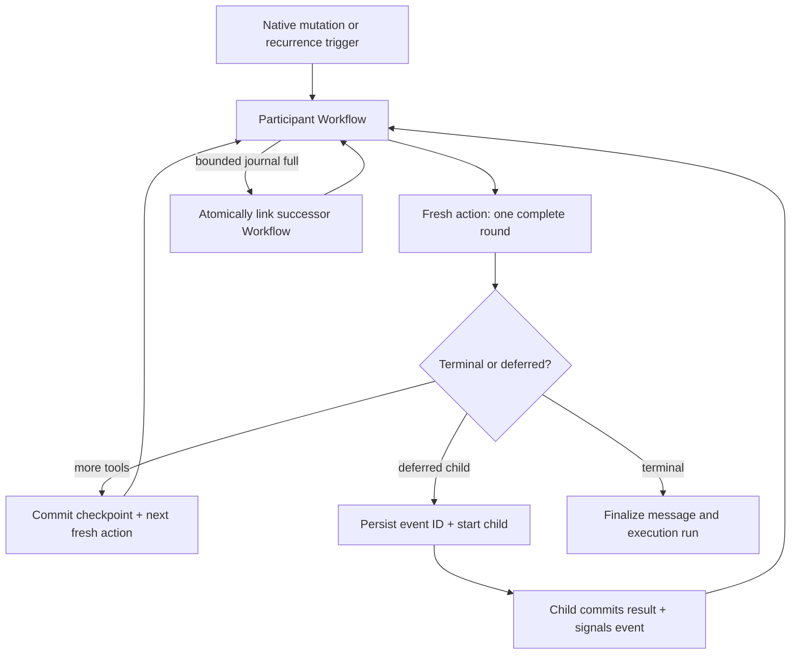

# Durable Orchestration Rollout

Status: M47 production implementation record and operating guide.

For new workload implementation, follow
[durable-workload-authoring.md](durable-workload-authoring.md). This document
describes the deployed workload map and rollout; legacy paths listed here remain
for compatibility and are not new extension points.

## Production decision

NanthAI uses Convex Workflow for ordered durable sequences and Convex Workpool for independent queued work. The existing OpenRouter round executor remains the model/tool engine. Convex application tables remain canonical; component history is never exposed as the product API.

The important runtime rule is simple: one Node action performs one complete model/tool round. When that round is safely stored, Workflow starts the next round in a fresh action. The agent loop can therefore run far beyond ten minutes without allowing any single action to exceed the Convex action budget.

This preserves the user's safety concern about being mid-stream near expiry: a step does not keep starting new unpredictable work until a timer is nearly exhausted. The durable boundary is the completed round, and every new round receives a fresh action budget.

## Component layout

| Component | Global parallelism | Work |
|---|---:|---|
| Workflow manager | 10 | Ordered research, generation, video polling, autonomous sessions |
| Interactive Workpool | 6 | Advisor calls, presentation studios/repairs/curators, research queries, and scheduled fan-out |
| Background Workpool | 3 | Post-processing, title generation, memory extraction |
| Maintenance Workpool | 1 | Embeddings and relationship rebuilds |

The initial total is 20 rather than 66. This is the Starter/S16 production
profile: it preserves the priority order while leaving headroom around S16's
eight concurrent scheduled-job executions and shared component coordination.
The numbers are global queue capacity, not per-user limits. Accepted PAYG work
queues durably under load. Raise them only from observed queue age and scheduler
lag, or after moving to a deployment class with materially more scheduled-job
capacity.

Automatic action retry is disabled by default in every component. Retries are enabled only where the M46 effect policy proves them safe. These are system queues, not per-user limits: accepted PAYG work waits under pressure instead of being rejected by an application allowance.

## Implemented workload order

| Order | Existing workload | Result on this branch |
|---:|---|---|
| 0 | Component foundation | Workflow plus three named Workpools mounted; compact IDs, operation links, cancellation, and retry-off defaults established |
| 1 | Memory maintenance | Embedding, relationship, and bulk-page work route through the maintenance pool with stable item/page ownership |
| 2 | Post-generation work | The response claims and enqueues post-processing atomically; title and memory extraction then use the background pool |
| 3 | Research paper/search | Workflow owns ordered planning/depth/synthesis phases and Workpool owns independent queries; persisted phase/session rows remain canonical |
| 4 | Scheduled jobs | Native scheduling owns recurrence only; every occurrence creates a fenced execution run and starts one ordered Workflow |
| 5 | Core chat | Each participant Workflow performs one complete model/tool round per action. Bounded component journals atomically chain successors, so there is no conversation round limit |
| 6 | Advisors | A batch Workflow owns the barrier and downstream handoff; independent consultations run in the interactive pool and signal one durable terminal event |
| 7 | Subagents | Each child owns a fenced child execution run and round Workflow; bounded journals chain successors and the parent checkpoint/event resumes exactly once |
| 8 | Presentations | One Workflow owns plan → studio fan-out/join → curator/repair → finalizer → snapshot; Workpool owns independent studio and repair work; revision-safe domain rows remain canonical |
| 9 | Autonomous chat | One Workflow owns ordered participant turns, durable delays, stop conditions, and terminalization; conversation order is deliberately not parallelized |
| 10 | Video/media | One child Workflow owns submit → sleep → poll → collect/upload → publish/terminalize; one-shot image/audio/document tools intentionally remain bounded direct calls |
| 11 | Analytics/charts | Data Python tools defer to a child Workflow with prepare, hydrate, execute, collect, normalize, persist, attach, resume, and cleanup phases. Deterministic artifact intents prevent replay duplicates and binaries stay in storage |

This is the required migration order for future workloads too: maintenance, ancillary work, bounded production-shaped workflows, chat, fan-out/join, the large presentation domain, ordered autonomous work, multi-stage media, then analytics/chart execution last.

## Why advisors, subagents, and presentations retain domain join state

Workflow/Workpool replace execution dispatch and action chaining, not product truth. Advisor partial-result reuse, subagent parent resumption, and presentation revision/repair selection are visible domain semantics. Removing those tables in favor of opaque component history would weaken recovery and client contracts.

The component operation ID is stored on the domain record for cancellation and observability. Completion still commits through the existing idempotent domain mutation. Before a deferred child starts, the parent Workflow creates an event and persists the parent checkpoint containing that event ID. The child terminal callback commits its result and signals that event; the same parent Workflow resumes without scheduler re-entry or a completion-before-wait race.

## Chart and uninterrupted-process boundary

The Pyodide and Vercel Sandbox tools now checkpoint before execution and run as
owned child analytics Workflows. Execution writes a raw, bounded envelope to
Convex storage. Later steps collect chart/output bytes into deterministic
artifact intents, normalize a bounded result, attach once, and signal the
parent. Workflow history contains only IDs and small summaries.

Workflow cannot make a single uninterrupted process live longer than Convex's action limit. If a chart, repository build, browser session, or in-memory workspace genuinely needs that:

1. prepare a M46 operation and predetermined artifact identities;
2. issue a runtime command to a user-owned or separately billed persistent executor;
3. return from the Convex action;
4. receive bounded heartbeat/events and storage-backed artifacts;
5. reconcile/attach exactly once;
6. start the next Workflow round.

M45 will implement Pi first on a user's machine, then permit other adapters. NanthAI does not keep an uncharged hosted VM open per user.

## Lifecycle and rollback

Rollback procedure:

1. deploy the last known-good routing revision if new Workflow dispatch itself must be stopped; there is no undocumented runtime flag;
2. never switch an existing attempt between engines;
3. allow active component operations to finish or cancel them through centralized teardown;
4. retain the M46 run/attempt projection and effect journal;
5. inspect `execution/queries:getLegacyOrchestrationDrainState`; remove compatibility handlers only when `drainComplete` is true. The query directly checks active generation/continuation schedule IDs and the advisor, subagent, Drive-picker, presentation, research, scheduled-job, autonomous, video, and execution-attempt lifecycle rows. Any capped source makes `inspectionComplete` and `drainComplete` false rather than allowing a false zero;
6. after the complete M48 gate passes, remove proven legacy-only routing, schedule-ID fields, duplicate action exports, and dead handlers in staged deletion changes.

The branch intentionally retains legacy handlers for safe deployment compatibility. They are not the path for new Workflow-managed attempts.

## Production rollout record

M46/M47 was deployed to development and production on 2026-07-19 with the
Starter/S16 pool profile above. The system skill catalog was reseeded to 67
entries in both deployments. Two production Drive-picker batch rows created on
2026-04-30 were confirmed to be hard orphans—their parent job, message, and chat
were absent—and removed with a bounded cleanup. The subsequent production drain
inspection covered all 18 sources without capping and reported zero active
legacy work. A second production check at 2026-07-19T22:31:18Z remained complete,
uncapped, and zero across all 18 sources.

Later production canaries on 2026-07-19 found two hotfixes required before the
rollout is considered operationally settled:

- `presentationProjects.parentResumeEventId` was persisted by the new parent
  resume path but omitted from the project's return validator, causing presentation
  Workflow retries with `ReturnsValidationError`;
- fresh V8 participant rounds scheduled stale-continuation cleanup asynchronously.
  A fast pre-provider V8-to-Node handoff could save a new checkpoint before that
  cleanup ran, after which the cleanup deleted the new checkpoint and left Workflow
  waiting on its event indefinitely.

The fixes keep the V8/Node split, add a schema-parity contract test for presentation
project returns, and make fresh-round cleanup complete before the participant may
write a replacement checkpoint. Operators must distinguish this failure from
capacity pressure: the affected production sample had Workpool backlog `0`, while
the missing continuation and a Workflow attempt in `waiting` state identified the
checkpoint race.

The same sample also measured roughly one second in the dispatch Workflow hop and
roughly 2.9 seconds in the participant Workflow hop before participant execution.
M47 therefore does add visible scheduled-execution latency on Starter/S16; it does
not change the provider's own TTFT once the request is dispatched. Treat prolonged
`waiting` with no continuation as a correctness incident, not ordinary queueing.

That result is the first M48 observation, not deletion authorization. Repeated
observations, representative current traffic, the maximum possible legacy
in-flight lifetime, released-client compatibility, and a staged rollback plan
must still be proved. See
[M48 Legacy Orchestration Retirement](../milestones/M48-legacy-orchestration-retirement.md).

## Dev verification and production gate

Before production:

- deploy to the configured development deployment and run `health:check`;
- run a signed-in no-tool response, multi-round tool response, cancellation, research paper, advisor/subagent deferral, video polling, and presentation generation;
- inspect Workflow and all three Workpool dashboards for terminal operations and queue age;
- interrupt a dev deployment between rounds and verify resume from the stored checkpoint;
- delete a chat with queued work and verify no later publish;
- verify no application quota response exists under repeated PAYG sends;
- compare TTFT, round duration, operation count, failures, storage bandwidth, and provider cost with the prior path.

Production rollout starts new work on Workflow/Workpool while in-flight legacy
work finishes normally. Rollback is a code deployment plus component
cancellation—not a configuration switch—and must remain rehearsed through the
M48 evidence window. A non-zero or capped drain result resets that window and
requires investigation; rows must never be mutated merely to make the gate
green.

## Source map

- Managers and queue policy: `convex/execution/components.ts`
- Generation Workflow/queue: `convex/chat/generation_workflow.ts`, `convex/chat/run_generation_queue.ts`
- Deferred generation events and successor handoff: `convex/chat/workflow_events.ts`
- Research: `convex/search/research_workflow.ts`, `convex/search/research_fanout_*`
- Video: `convex/chat/video_workflow.ts`
- Autonomous: `convex/autonomous/session_workflow.ts`
- Advisors: `convex/advisors/advisor_workflow.ts`, `convex/advisors/workflow_steps.ts`
- Subagents: `convex/subagents/subagent_workflow.ts`, `convex/subagents/subagent_workflow_handoff.ts`
- Presentations: `convex/presentations/presentation_workflow*.ts`
- Analytics/charts: `convex/analytics_workflows/*`
- Child fan-out: `convex/execution/fanout_queues.ts`
- Background/maintenance: `convex/execution/workload_queues.ts`
- Component start/cancellation: `convex/execution/workflow_starts.ts`, `convex/execution/teardown.ts`
