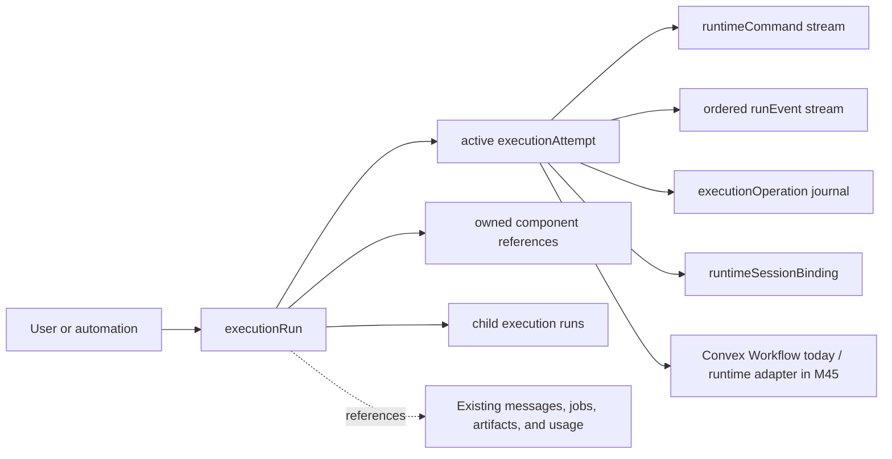
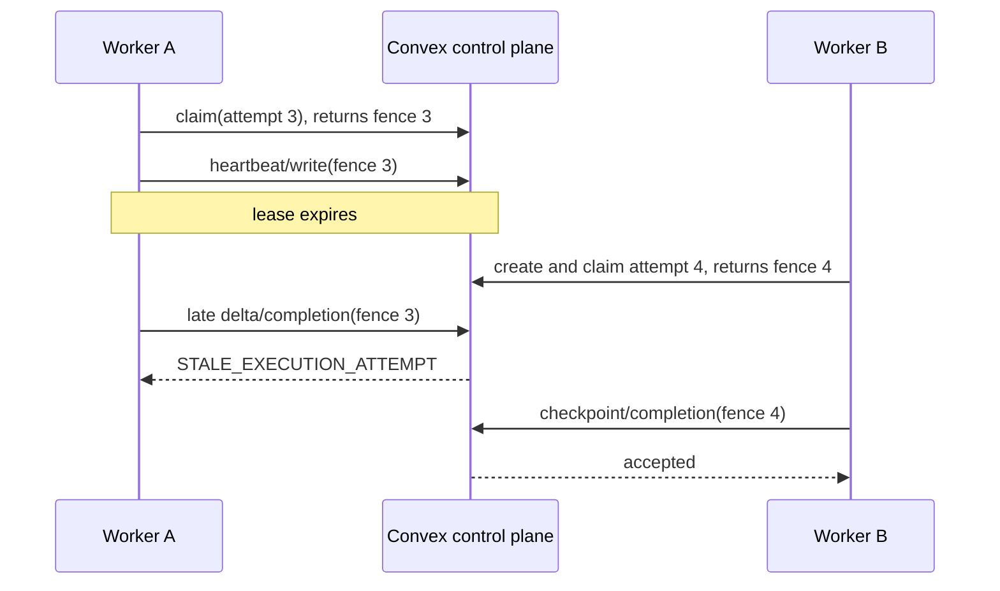

# Execution Control Plane

Status: implemented by M46 on `codex/m46-m47-durable-orchestration`. This is the canonical contract for cloud execution and the future M45 user-owned runtime adapters.

For implementation rules and the new-workload checklist, start with
[durable-workload-authoring.md](durable-workload-authoring.md). Legacy scheduler
and continuation paths are not extension points.

## What changed

Convex now owns a runtime-neutral execution graph in addition to the existing product records. `generationJobs`, messages, search sessions, presentation projects, generated files, usage records, and streaming rows remain the product truth. The execution graph owns only lifecycle, placement, ownership, commands, events, and replay safety.

The contract deliberately contains no Pi-, Codex-, OpenCode-, provider-, or Vercel-specific business state. M45 adapters bind opaque native sessions through `runtimeSessionBindings` and publish the same normalized events and projections.

## Ownership

| Record | Owns | Does not own |
|---|---|---|
| `executionRuns` | Logical request, canonical state, placement intent, cancellation, active attempt, terminal outcome | Transcript, prompt, tool payload, file bytes |
| `executionAttempts` | One executor placement, adapter metadata, claim, lease, heartbeat, fence, compact checkpoint reference | Product state or portable in-memory workspace |
| `runtimeCommands` | Append-only start/prompt/steer/cancel/resume/interrupt/permission/shutdown instructions | Authorization policy invented by the runtime |
| `runEvents` | Ordered, bounded lifecycle summaries | Raw stdout, full model output, binaries, secrets |
| `executionOperations` | Effect identity, input hash, dispatch state, replay/reconciliation result | A second artifact or connected-app database |
| `runtimeSessionBindings` | Opaque adapter-native session identity | A claim that unrelated harness state is portable |
| `executionComponentRefs` | Any number of owned Workflow, Workpool, external-cloud, or local-runtime operations | Product lifecycle state |

## State and fencing invariants

1. A logical run has at most one active attempt.
2. An attempt claim establishes an immutable attempt identity, claimant, lease, and fence.
3. Reclaim after expiry or a durable handoff creates a new attempt with a higher attempt number and fence, then permanently marks the prior attempt superseded. Attempt identities are never recycled.
4. Streaming deltas, reasoning, tool-call persistence, checkpoints, operations, events, heartbeat, and terminalization carry the attempt and fence.
5. A terminal run cannot be reopened. Repeated terminal cleanup is idempotent.
6. Workflow component IDs are stored only as orchestration references; clients never use them as product IDs.
7. Large values remain in existing Convex tables or storage. Workflow and command payloads carry compact IDs.

`convex/execution/runs.ts`, `attempts.ts`, and `control_plane.ts` own these transitions. `convex/chat/actions_execution_lease.ts` is the cloud participant adapter. The OpenRouter executor receives the resulting identity and all consequential writers validate it. A cancellation request closes the writer fence immediately, before remote cancellation acknowledgement.

### Claim sequence

## Commands and user authorization

Commands are idempotent transport, not an approval system. The user's current turn or configured automation remains the authorization unless a tool already requires an interactive permission decision.

Each command has a stable caller-supplied command ID, exact input hash, expected fence, authorization source, expiry, claimant, acknowledgement, and disposition. Only pending commands may be claimed or expire; only the claimant may consume an acknowledged command; terminal commands cannot regress. Replaying the same command and input returns the existing record. Reusing an ID for different input is rejected. This supports future local runtimes without introducing redundant confirmation dialogs.

## Tool effect and replay contract

Every registered tool receives a resolved policy at registration:

- read + safe: bounded automatic replay may occur;
- write + never: the current production default because no connected-app
  adapter yet forwards and verifies the journal key;
- write + idempotency-key-required: available only after a specific adapter
  proves provider-side key use or reconciliation;
- destructive + never: automatic resend is refused.

The production inventory is explicit in `convex/tools/effect_policy_inventory.ts`.
Registration fails closed for an unknown tool name; there is no name-based
production fallback.

Before dispatch, the registry writes an `executionOperation`. Reads may use the model tool-call ID; writes use the generation job, tool name, canonical input hash, stable durable-round scope, and same-round occurrence. The latter survives regenerated model tool-call IDs while keeping two intentional identical calls distinct. A successful duplicate returns the stored result. A prepared operation may transfer to a superseding fenced attempt because nothing was dispatched; once dispatch begins, non-safe automatic replay is refused. An ambiguous exception becomes `outcome_unknown` and cannot be blindly resent; an adapter or operator must reconcile it to an external ID/result first.

This policy covers connected-app writes, scheduled-job changes, files/documents/presentations, sandbox execution, search, advisors, and subagents without changing the user's product-level authorization choice.

## Cancellation and deletion

`convex/execution/teardown.ts` is the execution-graph teardown owner. Chat and account deletion call it before deleting product records.

The path:

1. walks the run tree from each requested root and handles descendants before their parents;
2. marks nonterminal runs `cancelling`, which immediately closes the writer fence;
3. rejects pending commands and revokes active runtime bindings;
4. cancels every linked Workflow and all three Workpools, including multiple component operations per attempt;
5. leaves unconfirmed component cancellations pending for the reconciliation cron
   instead of falsely claiming that remote work stopped;
6. emits `cancel_acknowledged` and terminalizes the attempt/run only after every
   owned component has settled;
7. deletes commands, events, operations, bindings, component references, attempts, and runs in bounded batches;
8. then permits existing domain cleanup to remove messages, generated files, sandboxes, and storage under their established ownership rules.

Account purge uses the fixed allowlist in `convex/account/purge_tables.ts`; new execution tables cannot silently escape deletion. Cleanup is repeatable and tolerates already-finished component work.

## Canonical client projection

`execution/queries:listMyRunProjections` is the shared authenticated lifecycle query. It exposes bounded state, kind/domain/parent identity, active attempt number and fence, placement, executor/runtime label, provider/model, checkpoint/lease, phase/progress, last event and artifact summary, cancellation state, input/permission waits, and terminal outcome.

Web, iOS, and Android subscribe to this projection. Streaming messages remain the low-latency content overlay, while the execution projection decides whether work is still active. DTO tests use live Convex number shapes and tolerate nullable and future fields.

## Compatibility and rollout

- New generation jobs atomically create and link a run and first attempt.
- Legacy fields and continuation handlers remain readable so work started before deployment can finish.
- A new Workflow attempt never switches to the legacy continuation engine mid-attempt.
- Existing client message and artifact contracts are unchanged.
- There is no application message, token, turn, or per-user concurrency quota. Global Workpools queue load as reliability backpressure.
- Provider HTTP 429 backoff remains transport resilience and is not a NanthAI usage restriction.

### Released-client compatibility certificate

The M46/M47 production deployment does not require an iOS, Android, or web client
release to land first:

| Contract surface | Compatibility rule on this branch |
|---|---|
| Public Convex exports | Existing query, mutation, action, and HTTP names remain present. New orchestration functions are additive/internal. |
| Function arguments | Existing required arguments remain valid. Execution identity, occurrence, workflow, and fence arguments added to compatibility paths are optional or are supplied only by backend callers. |
| Response payloads | Existing fields retain their names and shapes. New lifecycle fields are additive; released decoders ignore unknown fields. The scheduled trigger-token projection preserves `_id`, `_creationTime`, `userId`, and `jobId` while omitting the secret hash. |
| Schema | Existing required product fields are not removed or retyped. New execution tables and domain linkage fields are additive, with linkage optional for records created by the preceding deployment. |
| Product truth | Messages, streaming rows, jobs, files, presentations, research, advisors, and subagents continue to be written for old clients. The new execution projection supplements rather than replaces those contracts. |
| In-flight work | Engine identity is immutable per attempt. Legacy handlers, predecessor adoption, and the drain query remain until the complete M48 production gate proves no old attempt depends on them. |

This guarantees API and in-flight-work compatibility with the immediately preceding
released clients. It does not make an arbitrarily old client compatible with product
contracts that predate M46; normal minimum-version policy still applies to unrelated
historical changes.

Rollback stops routing new work to Workflow and leaves current Workflow operations to terminalize. It does not remove the execution schema or roll clients back to reconstructing state. See [durable-orchestration-rollout.md](durable-orchestration-rollout.md).

Legacy retirement is deliberately separate from M45. M48 may remove only
proved compatibility machinery; it must preserve runs, attempts, commands,
events, operations, component references, projections, and runtime-session
bindings that form the executor-neutral contract. M45 can therefore begin now
and must target those canonical surfaces rather than a legacy alias. See
[M48 Legacy Orchestration Retirement](../milestones/M48-legacy-orchestration-retirement.md).

## Verification map

| Risk | Coverage |
|---|---|
| Stale worker publishes after reclaim | `convex/tests/execution_control_plane.test.ts` |
| Duplicate or altered command | `convex/tests/runtime_command.test.ts` |
| Side effect duplicated or ambiguous | `convex/tests/tool_effect_journal.test.ts` |
| Client contract divergence | `convex/tests/execution_projection.test.ts` plus web/iOS/Android DTO tests |
| Deletion leaves orchestration state | account/chat deletion suites and centralized teardown |
| Behavioral regression | complete Convex, web, Android, and iOS build gates |

Production deployment requires the normal explicit release step. The M46 schema is forward-compatible with M45 but does not itself pair, trust, or execute on a user's device.
