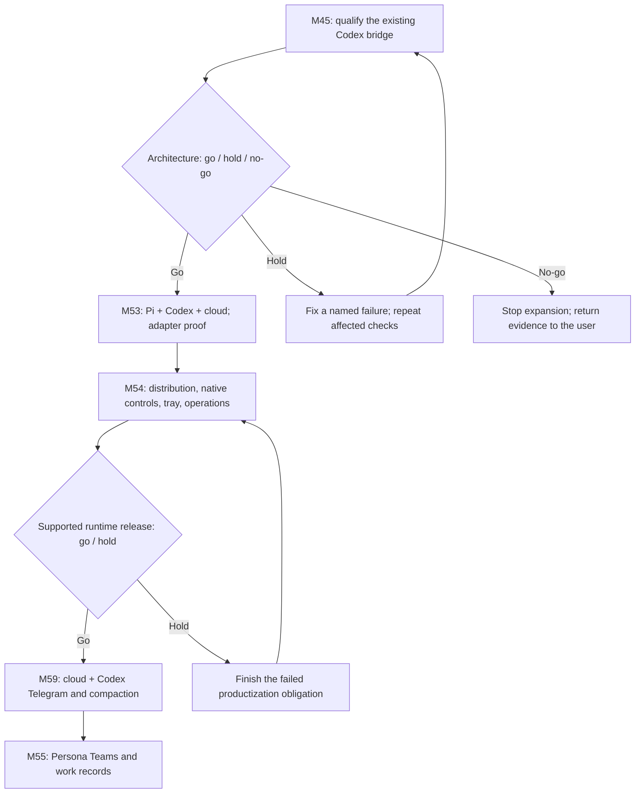
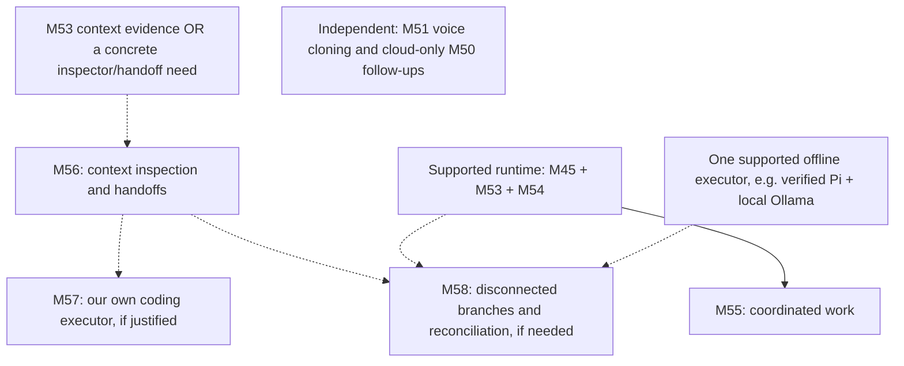

# Runtime and agent delivery roadmap

> Updated 2026-09-30. User direction: qualify and productionize the local runtime first; keep M59 cloud and Codex together. The order below is a recommendation for review, not implementation or release approval.
> Current plans live on main. Runtime code remains on `codex/m45-contract-spike`; imported evidence is pinned to [f05b40e4](https://github.com/thevarsek/nanthai-edge/tree/f05b40e4fec7bdd2f70d5c9839648f623b441812). Historical passes are not current release evidence.

## Recommended delivery order

M45 makes the first go/no-go small and concrete: prove the existing connected Codex journey before investing in Pi, a tray or another executor. M53 establishes the second supported harness. M54 closes the full macOS-first productization milestone, including native setup/control, schedules, accounting, external MCP and operational support. M54 work can overlap M53; its multi-harness closeout follows Pi proof. No milestone is marked complete because one slice works.

M59 follows that runtime block as one cloud/Codex release. Cloud-only Telegram is technically independent, but is not the chosen plan. M55 uses supported routes without requiring a benchmark win. Numbers are identities, not numerical delivery order. Optional Copilot and Windows/Linux certification do not delay the supported Mac release.

Solid arrows show delivery dependencies; dashed arrows show conditional investment/dependencies. M51 and cloud-only M50 follow-ups are technically independent but parked behind the runtime priority. M57 is not required for M58 if an external executor supplies the offline path. M56 is the normal shared-context route for M58, not a mandatory refactor for the connected host.

## Current position

| Theme | Milestone | Existing evidence / remaining value |
|---|---|---|
| Local execution | [M45](../milestones/M45-hybrid-long-running-agent-runtime.md) | Partly implemented, unreleased. Foreground package, pairing, Codex App Server, current Persona capture, context receipts/frontiers, web activation and result publication have local/DEV evidence. Connected personal-Mac, clean-install, multi-client and recovery proof remain. |
| Additional executors | [M53](../milestones/M53-multi-harness-runtime.md) | Planned Pi RPC with user-configured OpenRouter/Ollama and mixed rooms. Optional Copilot/ACP certification and context/source evaluation are distinct from adapter usefulness. |
| Supportable product | [M54](../milestones/M54-runtime-host-productization.md) | Planned signed/notarized distribution, tray/login, updates/uninstall, full web/iOS/Android setup/control, schedules, usage, external MCP and crash/soak support. Reuse M45 provisioning. |
| Channels and continuity | [M59](../milestones/M59-telegram-persona-conversations.md) | Planned Telegram private conversations and persistent summary-plus-uncovered-history preparation; cloud and Codex tested together. |
| Coordinated work | [M55](../milestones/M55-persona-teams-work-records.md) | Planned work records, requirements, implementer/reviewer, evidence and human steering; later mode consolidation only after approved parity. |
| Context inspection | [M56](../milestones/M56-context-engine-handoffs.md) | Conditional inspector and evidence-aware handoff. Extract shared context only for a real consumer. |
| Our own executor | [M57](../milestones/M57-native-coding-harness.md) | Conditional coding worker. Identify a benefit external routes cannot provide; evaluate before productizing. |
| Disconnected work | [M58](../milestones/M58-offline-context-reconciliation.md) | Optional local branches, durability and reconciliation. Not needed for the connected runtime. |
| Audio | [M51](../milestones/M51-voice-cloning.md) | Deferred reference-audio voice cloning; no runtime dependency. Provider/consent behavior still needs approval. |
| Existing Collaboration | [M50](../milestones/M50-collaborative-multi-participant-chat.md) | Cloud MVP delivered. Hybrid proof moves through M45/M53/M54; personal default, research, queued-input editing/removal, expanded usage and Autonomous tool/subagent follow-ups remain recorded, with consolidation in M55. |

Delivered foundations: M38/M38.5 context/artifacts, M43 runtime/tool boundaries, M44 memory graph, M46–M48 durable execution, M49 Remote MCP, M50 cloud Collaboration, M52 multimedia and M60 Jev. M28/M42 were removed. Optional OOXML fidelity is not an open M41 closeout gate.

M60 stays complete with its [recorded limitations](m60-release-report.md#release-closeout-and-remaining-follow-ups): 35 Android lint warnings, synthetic development evaluation rather than independent holdout, limited native/live-device coverage and unverified iOS store delivery. This migration imports plans/evidence, not runtime code.

## Feasibility review

Documentation and focused source review, not a fresh runtime certification. Unproven means missing evidence, not a reproduced failure.

| Concern | Evidence and consequence | Delivery disposition |
|---|---|---|
| M45 is not yet end-to-end certified | [September handoff](runtime-host-local-work-2026-09-11.md) lacks connected personal-Mac/clean-machine, native and crash/churn proof. A local Codex smoke is insufficient. | First qualification work; retain the selected App Server transport unless an actual failure warrants reconsideration. |
| Private native context can advance externally | Recorded frontier preflight is not an atomic lock against simultaneous use of the same thread by another Codex client. | Test real concurrent advancement/publication. Report residual limitations; this review invents no new user restriction. |
| Very long ordinary history can omit the current turn | Main `listAllMessagesHandler` still reads ascending `.take(5000)`; budget selection is not persistent cross-turn compaction. [Audit](conversation-compaction.md); production incidence unmeasured. | M59 owns long-thread compaction. Any correctness failure reproduced within M45 qualification is resolved there rather than deferred as breadth. |
| No-OR readiness needs whole-journey proof | Local title fallback/memory preparation are recorded; full helper/search/summary/schedule paths are not certified without OR. | M45 proves ordinary advertised use; M54 audits advertised helpers. No hidden provider fallback or unapproved credential export. |
| M54 is substantial | Distribution, native controls, schedules, accounting, MCP and a 24-hour recovery/soak are real work. | Use named acceptance checkpoints; close the full supported matrix before calling productization done. |
| Sleeping/off Macs cannot execute local work | The design has an explicitly owned foreground/tray process, with no wake service. | Test readiness/sleep/restart. Offline schedule and helper-routing rules remain proposals requiring approval. |
| Exact external context is not observable | External harnesses can add/compact private history. | M56 distinguishes prepared/delivered evidence from opaque native state; no promise to inspect/replace every token. |
| Context and team gains are hypotheses | No M53 result exists. More agents/fewer prompt tokens do not prove better whole-run outcomes. | Negative context evidence does not block useful adapters/M54. M57 needs a separate benefit decision. |
| Team isolation can be overclaimed | Worktrees share Git metadata/resources; Persona prompts do not enforce read-only access. | M55 verifies the exact approved workspace policy. Model review remains advisory. |
| Telegram delivery is not execution success | Undelivered updates are retained at most 24 hours; remote deletion is limited; ambiguous sends may already have arrived. [Bot API](https://core.telegram.org/bots/api). | M59 needs durable inbox/outbox and deduplication. Delivery retries never rerun inference/tools; do not promise universal remote erasure. |
| Offline is not the host plus a cache | Convex claims, cloud sources and online inference are unavailable or stale; tool-log replay can duplicate effects. | Keep M58 optional; qualify one explicit offline executor and reconciliation journey only if demand justifies it. |

Imported specs include proposed policies/defaults: activation route requirements, offline schedule disposition, child routing, Team limits/read-only enforcement, Telegram queue/admission/link confirmation, compaction failure behavior and offline conflict/retention choices. Publication on main does **not** approve them. Present the exact behavior, affected users, alternatives and tradeoffs under root AGENTS.md before implementation. No new quota, confirmation, default or restriction is applied here.

## M58 in plain language

| Mode | What works | What it does not establish |
|---|---|---|
| Connected local runtime: M45/M53/M54 | Mac executes a supported harness; Convex coordinates/stores shared conversations. Inference may be online or a verified local provider. | Operation without Convex, execution while Mac is off, or fully local data/privacy. |
| Backend-disconnected: optional M58 | An explicit local branch from a known checkpoint can use local files/tools and an available online inference credential while Convex is unreachable. | Ownership of a live cloud task, fresh cloud settings or automatic synchronization. |
| Fully offline: optional M58 | Local state/tools plus an already installed local model; reconnect later proposes an import/patch. | ChatGPT-backed inference, cloud integrations or automatic conflict-free merging. |

M58 is technically plausible with bounded scope. [Ollama documents local-only operation](https://docs.ollama.com/faq); [Codex documents local providers](https://developers.openai.com/codex/cli/reference), but neither certifies a NanthAI offline adapter. Pi with a verified local Ollama model is another candidate. M57 is not inherently necessary. A blocked-network test must prove the supported inference/tool path.

The hard part is durability and reconciliation: crash-safe checkpoints/artifacts, changed requirements/Personas, code conflicts, revoked access and external writes already performed. [SQLite backup](https://sqlite.org/backup.html) supports consistent snapshots; [WAL documentation](https://sqlite.org/wal.html) explains why copying a live database alone is insufficient. These are primitives, not evidence M58 is built. Self-hosted Convex is a different deployment choice, not automatic offline/cloud merge.

Recommendation: retain M58 as optional future work outside the connected-runtime go/no-go. It must not delay M45/M53/M54/M59.

## First actionable checkpoint: M45 qualification

1. Resume an isolated runtime checkout and deliberately reconcile latest main, including M52/M60 and shared-contract changes. Preserve existing work and shared DEV M45 schema/data; do not deploy this docs-only main checkout to shared DEV.
2. Establish fresh backend, Runtime Host and web checks. Build/test relevant native clients. Record actual source/package/controller versions and failures; historical test counts are not fresh passes.
3. Web first against matching DEV: fresh install/pair/no-OR ordinary chat, current Persona edits/deletion, cloud → Codex → cloud, two sessions, two local Personas, images and artifact reuse by another client/peer.
4. Test approvals/questions/Stop, host crash/reconnect, late events, duplicate publication, external native advancement, revoke/unpair/uninstall and rollback. Test iOS/Android virtual devices, then real Mac/native devices where hardware proof is required.
5. Report GO (supported journey works), HOLD (named fix and bounded retest), or NO-GO (fundamental blocker with evidence). User decides release/investment. On NO-GO, do not silently substitute cloud-only M59.

No new paid evaluation, bot configuration, third-party installation or production runtime deployment is authorized here. M53's proposed $25 screen is not spending permission; the earlier M60 $10 test ceiling is not a new benchmark budget. Runtime implementation starts after the proposed next step is accepted.

## Ownership and evidence

Current specs replace broad M45 / benchmark-only M53 / intermediate numbering proposals. M45 retains task IDs and explicit transfers to M53/M54. M50 cloud evidence remains dated. M59 owns persistent compaction; M56 consumes that contract. Convex/M46/M47 remain the connected source of truth and execution plane.

Use [architecture](runtime-host-architecture-decision.md), [experiment disposition](runtime-experiment-policy.md), [evaluation](runtime-context-evaluation.md), [research](runtime-research.md), [Telegram architecture](telegram-persona-conversations.md) and [compaction contract](conversation-compaction.md). Runtime-package links point to pinned parked source where absent on main. Dated evidence is not a deployment claim.

Upstream feasibility references checked 2026-09-30; adapter releases still pin/test supported versions. Public release after validation follows the user's no-feature-flags direction. Operator recovery controls and account disconnect are distinct from audience gates and must not add unapproved friction.
