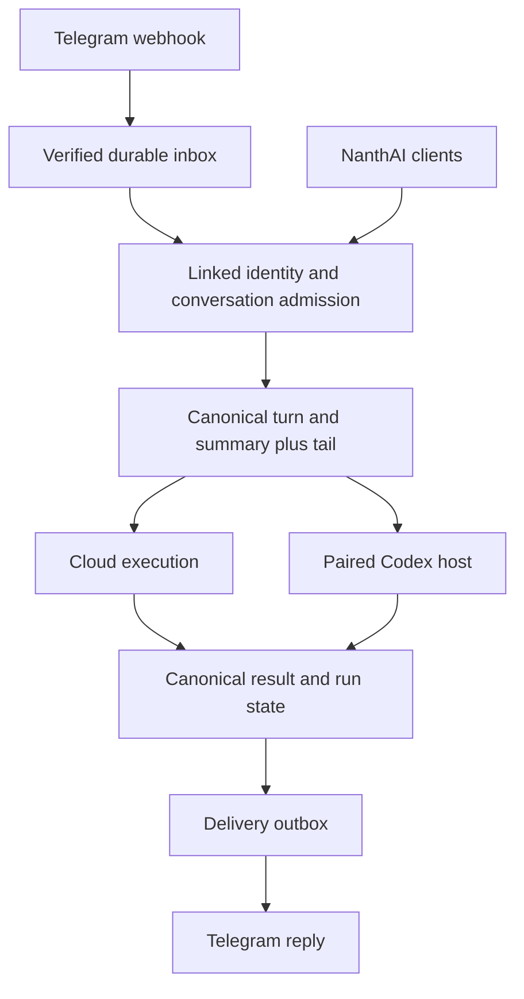

# Telegram persona conversations

> Proposed implementation for [M59](../milestones/M59-telegram-persona-conversations.md), reviewed 2026-09-18. No bot, webhook, schema or production capability is created by this document.

## Product flow

In NanthAI Settings or a persona's channel entry point, the signed-in user chooses Connect Telegram. A short-lived opaque link opens the managed bot. The bot records the claimant's immutable Telegram user/chat IDs, and the user confirms that claim in authenticated NanthAI before activation. The link alone must not let its holder export another account's history.

The user selects an owned single-persona conversation or creates a dedicated one. Binding an existing conversation enables future replies/status delivery after explicit consent; it does not replay its old transcript. Telegram shows which persona and conversation are active. `/new` creates another canonical conversation; `/persona` selects an authorised binding; `/status` reports the actual run; `/stop` cancels the selected active run; `/disconnect` revokes the link. Commands are consumed as controls, never inserted as persona instructions.

Start with ordinary private DMs and one selected conversation per user/bot chat. Persona switching changes routing, not ownership. Keep a binding revision so delayed replies and queued inputs cannot be delivered into the newly selected conversation by accident. Replies to an older bot message must either resolve to that message's original authorised binding or explicitly ask the user to switch; never silently reinterpret them under a different persona.

## Ownership and data flow

Convex owns identity mappings, conversations, current persona resolution, scoped memory, compaction and execution. The adapter validates transport and renders results. The Runtime Host keeps its existing outbound connection; Telegram never connects to the user's computer or receives provider credentials.

## Proposed records and entry points

| Record | Minimum meaning |
|---|---|
| Link grant | Hashed random single-use token; NanthAI owner; expiry; pending Telegram claimant; authenticated confirmation; consumed/revoked state |
| Channel identity | Platform and bot identity + immutable external user ID mapped to one owner; authority version; active/revoked state |
| Conversation binding | Identity + external private chat, optional future topic key; canonical chat/participant/branch; binding revision; explicit delivery scope and activation cursor |
| Inbox item | Bot + `update_id` uniqueness; external message/edit identity; captured binding revision; bounded payload; admission status and canonical message/run IDs |
| Delivery item | Binding revision + canonical output/status revision + part number; external message IDs; attempt/effect identity; pending/sent/failed/unknown/cancelled state |

These are proposed domain records, not new execution engines. Use `convex/channels/` for shared concerns and `convex/channels/telegram/` for provider-specific ones. Register a narrow HTTP handler in `convex/http.ts`; keep the bot token and webhook secret server-side and redact token-bearing request URLs in diagnostics. No extra bot framework is required for the first HTTP adapter.

## Admission, ordering and authentication

1. Authenticate the webhook with the configured Telegram secret header, validate the update shape/size and allowlisted update types, and reject non-private/unlinked senders. A Telegram username or supplied NanthAI ID is not authority.
2. Atomically persist/deduplicate the inbox record before acknowledging. If persistence fails, do not report durable acceptance. A repeated update returns the recorded result without another turn.
3. Resolve the active identity and binding server-side; verify current ownership, persona access, entitlements, route readiness and cancellation/deletion state. Recheck authority when queued work executes and before outbound publication.
4. Reuse a shared canonical send service. The current `sendMessageHandler` calls `requireAuth(ctx)`; a webhook has no Clerk session. Extract a narrow trusted-actor service behind separate authenticated public and internal channel entry points. Do not fake a JWT, expose arbitrary-user public mutations, or copy the whole send implementation.
5. Record the current binding revision and order accepted instructions through one canonical conversation admission owner. Serialize active turns for the v1 single-persona path; preserve queued inputs and apply the same rule to NanthAI sends into that bound conversation. `/stop` is a separate immediate control. Queue limits produce an explicit rejection, never hidden input loss.
6. Deduplicate by bot/update identity, not by a single largest-seen update number that drops late deliveries. Record transport order separately from canonical accepted order; bound any reorder window and make a late message's placement explicit. Do not wait indefinitely for gaps across unrelated Telegram chats.

After an accepted edit, v1 asks the user to send a correction as a new message rather than silently rewriting an executed instruction. Repeated edits still deduplicate. Telegram deletion cannot be assumed to delete NanthAI history; provide NanthAI deletion controls and document the boundary.

## Execution, approvals and delivery

- Use existing M46/M47 run/attempt/fence/component ownership. Ordered work and waits use Workflow; independent delivery work uses the appropriate bounded pool. Large payloads live in domain storage, not workflow journals.
- Resolve the latest persona on each new turn; replay retains effective execution configuration. Local execution honours the selected device and M45 capability matrix. If it is unavailable, preserve the input and expose an explicit retry; do not silently run it later after an indefinite offline wait.
- `/stop` resolves the authorised run at the captured binding, closes its fence and invokes existing teardown. Stale callbacks cannot approve/cancel another conversation or a new attempt. Pending native input/approval receives a NanthAI URL requiring normal login and ownership checks; Telegram delivery cannot decide permission.
- Publish canonical final output first, then enqueue delivery independently. Delivery failure leaves the result accessible in NanthAI. Never rerun generation to repair a failed send.
- Use text plus status and signed-in result links in v1. Split long output at formatting-safe boundaries under current API limits, label parts, escape markup and maintain per-part delivery state. Treat progress as replaceable/coalesced, with final output authoritative.
- Reuse Telegram message IDs for supported edits/retries. A timeout after an external send may mean the send succeeded. Journal an unknown outcome; surface the NanthAI result and a deliberate resend choice with duplicate risk rather than blindly sending again. Exactly-once model execution does not imply exactly-once external delivery.
- Honour rate-limit retry hints with bounded backoff. Blocked bot/permanent errors disable delivery visibly; token failures pause the connector. A backlog must not dispatch stale binding results after disconnect or account/chat deletion.
- Do not expose private reasoning, hidden native transcripts or local file paths. Only deliberately published authorised artifacts are linked. The consent surface states that delivered content is copied into Telegram and is subject to that service's handling.

The same canonical conversation may be continued in NanthAI. Future eligible assistant outputs in the opted-in conversation can be delivered from either interface, but user messages and older history are not automatically exported. Store origin and output mapping to prevent delivery echoes from creating new turns.

## Long-thread continuity

The [shared compaction contract](conversation-compaction.md) is mandatory for M59. Telegram never summarises independently. A new turn reads the valid committed summary plus the complete authorised uncovered tail. Trigger compaction from shared context pressure, not message arrival. A new summary version causes a proven native replacement/reset when existing Codex context cannot be safely updated; unchanged versions use the normal receipt/delta path.

The current source has execution-loop compaction but ordinary history truncation and an oldest-5,000 query cap. The audit document names exact owners and required fixes. M59 cannot advertise reliable very long conversations merely because the existing `compaction.ts` helper exists.

## Verification matrix

| Layer / scenario | Evidence required |
|---|---|
| Linking | Expired/consumed token, stolen-link claim without owner confirmation, two users with similar names, duplicate confirmation, revoke/relink; one validated owner |
| Webhook | Wrong/missing secret, unsupported payload/type, bot/unlinked/group sender, persistence failure; no canonical effect on rejection |
| Duplicate/reordered delivery | Replay identical update before/after crash; late update after a larger ID; same update ID from another bot; one accepted turn per legitimate update |
| Shared send | Channel and signed-in app use the same entitlement/persona/branch policy; externally supplied owner IDs rejected; no public trusted-user bypass |
| Queue and binding | Burst messages, app send during Telegram run, persona switch with queued input, reply to old bot message; no lost input or cross-conversation response |
| Execution lifecycle | Crash/replay, stale fence, `/stop` during work/approval, offline host, account/chat deletion; no late tool/result publication |
| Approvals and input | Link requires login/ownership; stale request cannot approve a later attempt; response in NanthAI unblocks the same run; cancellation remains available |
| Result delivery | Generation succeeds/send fails; partial multipart delivery; 429; blocked bot; ambiguous timeout; delivery retry does not repeat inference/tools |
| Privacy and media | No unrequested historical export, no echo loops/private native trace; unsupported voice/file input gets a visible response; artifact URL requires access |
| Compaction | All cases in `conversation-compaction.md`, with captured requests and call counts, including >5,000 messages and two summary generations |
| Codex continuity | Unchanged summary resumes with missing tail; summary replacement seeds one fresh session; native private compaction/frontier mismatch does not lose or duplicate canonical messages |
| Cross-client UX | Web/iOS/Android link, selected binding, disconnect and nullable/future DTO fields; shared conversation shows the same accepted messages/results |

Fixtures should use injected Telegram and summariser transports, fake time and explicit failure injection. Assert canonical message/run/effect counts and outbound bodies, not just HTTP status. Existing unit coverage is necessary but a composed inbox → canonical preparation → execution → outbox test must prove the whole path.

Real DEV journey: link a test account, select a cloud persona, send several turns, continue in NanthAI, then switch to an available Codex persona on the certified Mac. Exercise an approval link, cancellation, host offline/recovery and a published artifact. In a long-thread fixture with early constraints and a later correction, cross two configured compaction boundaries, restart the host and send another turn from Telegram. Capture summary versions/frontiers and actual delivered context; restore test thresholds afterward. Record actual API/adapter versions, metered cost and unavailable platforms. Do not claim real-message or provider tests from mocked CI.

## Operations and rollout

Before release document bot creation/ownership, environment-separated tokens, webhook registration/secret rotation, restricted update subscriptions, link revocation, retention/cleanup and safe rollback. Creating/changing a real bot or sending test messages requires the applicable explicit operational authorization; this planning document performs none.

Diagnostics: admission latency, duplicate/rejected updates, pending queue age, selected route/offline reason, generation versus delivery outcome, unknown sends, compaction count/cost, summary version/coverage, tail size, input budget, and native resume/reset reason. Correlate opaque IDs without logging secrets or full private transcripts by default.

Disable new links/ingress independently from delivery retries. On rollback, stop new external effects, terminalise/cancel owned work and preserve canonical chats/results/summary records. Do not delete successful conversations or promise deletion of all already-delivered Telegram copies.

## Primary references and adoption decisions

Reviewed 2026-09-18; verify again against the actual implementation API version.

| Source | Pattern / limitation | Decision |
|---|---|---|
| [Telegram Bot API](https://core.telegram.org/bots/api#setwebhook) | Webhook secret header, update IDs/types, message methods and API limits | Authenticate ingress, persist before acknowledgement and track delivery per part |
| [Bot deep linking](https://core.telegram.org/bots/features#deep-linking) | Startup parameters support account linking | Pass an opaque expiring token; require NanthAI confirmation before activation |
| [Bot FAQ](https://core.telegram.org/bots/faq#my-bot-is-hitting-limits-how-do-i-avoid-this) | Messaging limits and flood control | Bounded queues/backoff and coalesced progress; do not hard-code assumptions from an old SDK |
| [Bot features](https://core.telegram.org/bots/features) | Private topics and response drafts are available | Optional later UI breadth; ordinary private messages remain the first release contract |

These sources describe transport capability. They do not prove NanthAI authorisation, compaction, native permissions or release readiness.
